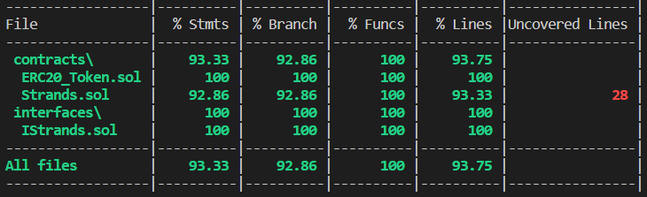
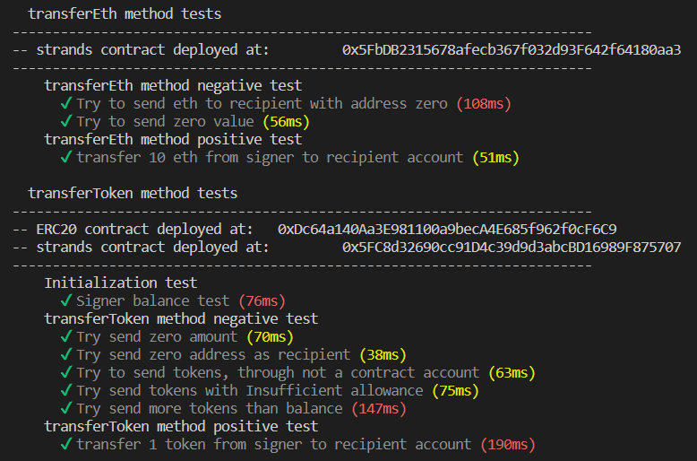
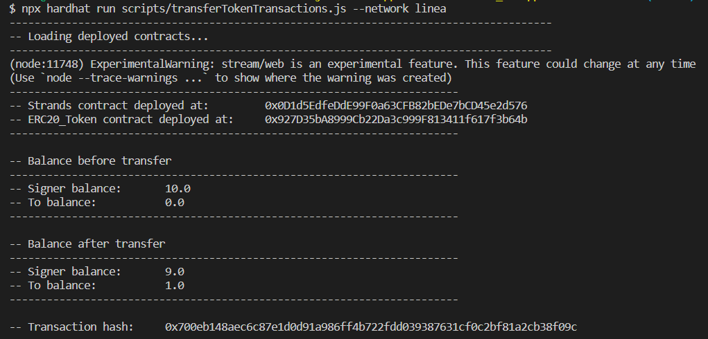
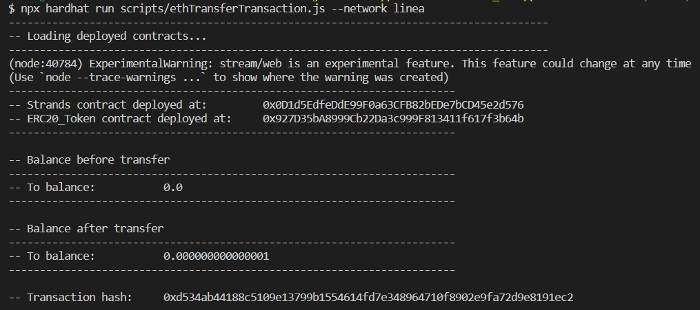

# Strands
##### Author: David Gimenez Gutierrez

### Main project information

#### Deployed contract address on Sepolia testnet

* Strands contract address: 0x9240C980f1090e3bd54038bDe4D63e489C429cf6
* [Link to the contract verified in LineaScan:](https://goerli.lineascan.build/address/0x0d1d5edfedde99f0a63cfb82bede7bcd45e2d576#code)
* [Token transfer transaction link:](https://goerli.lineascan.build/tx/0x700eb148aec6c87e1d0d91a986ff4b722fdd039387631cf0c2bf81a2cb38f09c)
* [Eth transfer transaction link:](https://goerli.lineascan.build/tx/0xd534ab44188c5109e13799b1554614fd7e348964710f8902e9fa72d9e8191ec2)

#### Folders

* **src/contracts**
    Contains the contracts used in the solution

* **src/interfaces**
    Contains the interface defined for the solution

* **scripts**
    Contains the deploy file to deploy the contract to blockchain networks and the the scripts 
    to perform the required transactions that execute the requested functions on the Sepolia testnet

* **test**
    Contains the test files to test the defined functionalities

#### Files

* **src/contracts/Strands.sol**
    Contains the contract that implements the interface defined with the functions requested for the test. 
    Include a description in the comments.

* **src/contracts/ERC20_Token.sol**
    This contract inherits from the OpenZeppelin ERC20 contract to emulate the operation of a compatible ERC20 token, in order to test the functionalities requested for the test.

* **src/interfaces/IStrands.sol**
    Contains the interface defined with the functions requested for the test. Include a description in the comments.

* **scripts/deploy.js**
    Contains the script to deploy the contract to blockchain networks

* **scripts/deployERC20.js**
    Contains the script to deploy the ERC_token contract to blockchain networks

* **scripts/transferTokenTransactions.js**
    Contains the script to execute the token transfer using the requested transferToken method

* **scripts/ethTransferTransactions.js**
    Contains the script to execute the eth transfer using the requested transferETH method

* **test/transferEth.test.js**
    Contains the tests on the requested functionality "transferEth". 
    For these tests it was assumed that the amount to be transferred from the contract would be an amount received at the time of calling the function

* **test/transferToken.test.js**
    Contains the tests on the requested functionality "transferToken". 

### Used libraries

* @openzeppelin/contracts: ^4.9.3
* solidity-coverage: ^0.8.2
* chai: ^4.3.7,
* ethereum-waffle: ^4.0.10
* hardhat-contract-sizer: ^2.8.0
* @nomiclabs/hardhat-etherscan: ^3.1.7

### Repository setup instructions

1. Install Visual Sutidio Code: https://code.visualstudio.com/

2. Install NodeJS that includes npm: https://nodejs.org/en/download/

3. Install Git that includes bash terminal: https://git-scm.com/download/win

4. **Recommended:** Set Git bush as you default terminal in VSCode
    * Open the command palette using Ctrl + Shift + P.
    * Type - Select Default Profile
    * Select Git Bash from the options

5. Install the following extensions in VSCode
    * Solidity - Nomic Foundation
    * Live Server - Ritwick Dey

7. Clone the repository in the local environment

8. Open project folder in VSCode

9. Install the project dependencies with the following commands
    * npm install

### Test coverage

The tests carried out cover 100% of the code lines

Test run on virtual hardhat network:

### Requested operations

#### transferToken

* Transaction hash on the Linea network: 0x700eb148aec6c87e1d0d91a986ff4b722fdd039387631cf0c2bf81a2cb38f09c
* Amount of tokens transferred: 1

#### transferEth

* Transaction hash on the Linea network: 0xd534ab44188c5109e13799b1554614fd7e348964710f8902e9fa72d9e8191ec2
* Amount transferred: 1000 wei

